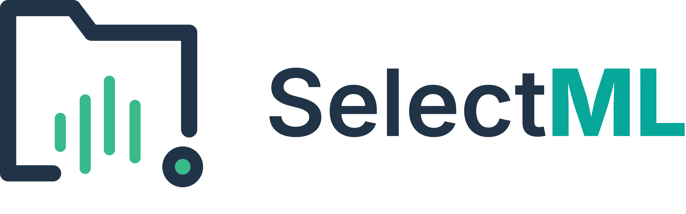

<p align="center">
  <picture>
    <source media="(prefers-color-scheme: dark)" srcset="docs/SelectML-logo-dark.png">
    <source media="(prefers-color-scheme: light)" srcset="docs/SelectML-logo-light.png">
    
  </picture>
</p>

# SelectML - Interface de monitoramento e entrega de arquivos de medição


> **Versão 1.2.3**
> Novidades:
> - **Atualização automática silenciosa:** A aplicação agora verifica e baixa atualizações em segundo plano de forma totalmente automática na inicialização.
> - **Reinicialização instantânea:** Inclusão da ação "Atualizar e Reiniciar" no modal de atualização que fecha o sistema, aplica o patch de atualização e o reabre na nova versão de maneira imediata.
> - **Identidade visual renovada:** Logotipo dinâmico responsivo a tema no repositório, novos ícones de aplicação e splash screen com estampagem automática de versão.
> 
> [Baixar última versão](https://github.com/ramso-adnarim/SelectML/releases/tag/1.2.3) 

## 🗺️ Mapa do repositório

Para navegar com eficiência no código e documentação:

- **[🤖 AI Codebase Map](docs/AI_CODEBASE_MAP.md)**: Índice otimizado para Agentes de IA.
- **[🏛️ Arquitetura Técnica](docs/ARCHITECTURE.md)**: Diagramas, Fluxo de Dados e Decisões de Design.
- **[🔌 Guia de Plugins](docs/PLUGIN_GUIDE.md)**: Como criar parsers para novas máquinas.
- **[📟 Configuração Serial](docs/SERIAL_CONFIGURATION_GUIDE.md)**: Ajustes de comunicação com dispositivos seriais.

---

## Visão geral do projeto

O **SelectML** é um **Middleware** desenvolvido em **WPF (.NET 8)**. Ele atua como uma ponte entre máquinas de medição (CMMs, VMMs e etc) e o software MeasurLink da Mitutoyo.

Diferente de um simples "copiador de arquivos", o SelectML oferece uma camada robusta de **governança de dados** e **validação em tempo real**, garantindo que apenas dados limpos e padronizados cheguem ao banco de dados.

**Principais funcionalidades:**
- **Híbrido (Novo):** Aceita tanto arquivos de CMMs quanto medição serial manual (Paquímetros).
- **Validação SQL:** Verifica se o Lote e as Características existem no banco de dados antes de processar.
- **Human-in-the-Loop:** Interface para revisão manual dos dados com destaque visual para erros ou features desconhecidas.
- **Ciclo de Vida Seguro:** Backup automático de todos os arquivos brutos (Raw Data).
- **System Tray:** Roda silenciosamente na bandeja do sistema.

---

## Arquitetura Simplificada

O sistema segue o fluxo:
`Máquina/Serial -> Buffer -> Validação -> CSV Padronizado -> MeasurLink`

---

## Configuração (appsettings.json)

A aplicação é configurada através do arquivo `appsettings.json`.

**Exemplo de Configuração:**
```json
{
  "WatchDirectory": "C:\\Medicoes\\Input",
  "LastPluginName": "ViciVision M1",
  "DbServer": "localhost\\MLSQLExpress",
  "DbUser": "sa",
  "DbPassword": "MySecurePassword",
  "DbName": "SelectML",
  "DbUseWindowsAuth": false,
  "DataRetentionDays": 30,
  "IsDarkMode": true
}
```

**Novas Chaves:**
*   `DataRetentionDays`: Define quantos dias os arquivos de backup e logs são mantidos antes da limpeza automática (Padrão: 30).
*   `IsDarkMode`: Persiste a preferência de tema do usuário.
*   `Db*`: Configurações granulares de conexão SQL.

---

## Guia de Desenvolvimento de Plugins

Deseja integrar uma nova máquina (ex: Hexagon, Zeiss, Keyence) com formato de arquivo diferente?
O SelectML utiliza uma arquitetura de plugins aberta.

1.  Crie uma Class Library (.NET 8).
2.  Implemente a interface `IMachineParser`.
3.  Retorne um objeto `MeasurementData`.
4.  Coloque a DLL na pasta `/Plugins`.

👉 **[Leia o guia completo de plugins aqui](docs/PLUGIN_GUIDE.md)**

---

## Instalação e Execução

### Pré-requisitos
*   Windows 10/11
*   .NET 8 Runtime (ou SDK para desenvolvimento)
*   Acesso a uma instância SQL Server (para validação de lotes)

### Compilando
```bash
git clone https://github.com/seu-org/SelectML.git
dotnet build -c Release
```

### Executando
O executável principal é `SelectML.Client.exe`.
Ao iniciar, o ícone aparecerá na bandeja do sistema (próximo ao relógio). Clique duas vezes no ícone ou use o botão direito para interagir.

---

## Estrutura do Repositório

*   `/SelectML.Client`: Aplicação WPF (UI, Serviços, ViewModel).
*   `/SelectML.Core`: Contratos e Modelos compartilhados.
*   `/SelectML.Parsers.*`: Projetos de exemplo de plugins.
*   `/docs`: Documentação técnica detalhada.
