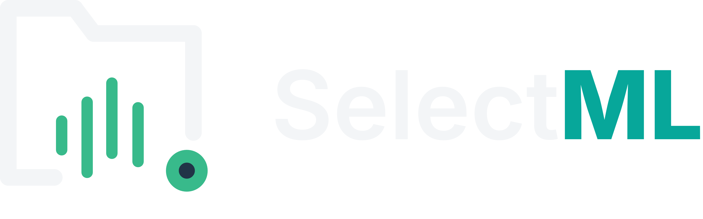

<p align="center">
  
</p>

# SelectML - Monitoramento de Medições Industriais


> **Versão 1.2.0 Released!**
> Novidades V1.2.0:
> - **Flexibilidade**: Parser Zeiss configurável via JSON (labels de características).
> - **Roteamento Inteligente**: Novo suporte para escolha de Diretório de Saída (OutputDirectory).
> - **Governança**: Modal Inteligente de Seleção de Estação para corridas desconhecidas (UI Modernizada).
> - **Precisão de Dados**: Extração dinâmica do máximo de casas decimais do PDF para o arredondamento GMS.
> 
> [Baixar Última Versão](https://github.com/ramso-adnarim/SelectML/releases/tag/1.2.0) 

## 🗺️ Mapa do Repositório

Para navegar com eficiência no código e documentação:

- **[🤖 AI Codebase Map](docs/AI_CODEBASE_MAP.md)**: Índice otimizado para Agentes de IA e novos devs.
- **[🏛️ Arquitetura Técnica](docs/ARCHITECTURE.md)**: Diagramas, Fluxo de Dados e Decisões de Design.
- **[🔌 Guia de Plugins](docs/PLUGIN_GUIDE.md)**: Como criar drivers para novas máquinas.
- **[📟 Configuração Serial](docs/SERIAL_CONFIGURATION_GUIDE.md)**: Ajuste fino para RS232 e U-WAVE.

---

## Visão Geral do Projeto

O **SelectML** é uma solução de **Middleware Industrial** desenvolvida em **WPF (.NET 8)**. Ele atua como uma ponte inteligente entre máquinas de medição (CMMs, ViciVision, Zeiss) e os sistemas de gestão de qualidade (MES/ERP).

Diferente de um simples "copiador de arquivos", o SelectML oferece uma camada robusta de **Governança de Dados** e **Validação em Tempo Real**, garantindo que apenas dados limpos e padronizados cheguem ao banco de dados corporativo.

**Principais Funcionalidades:**
- **Híbrido (Novo):** Aceita tanto arquivos de CMMs quanto medição serial manual (Paquímetros).
- **Validação SQL (Early Detection):** Verifica se o Lote e as Características existem no banco de dados antes de processar.
- **Human-in-the-Loop:** Interface para revisão manual dos dados com destaque visual para erros ou features desconhecidas.
- **Ciclo de Vida Seguro:** Backup automático de todos os arquivos brutos (Raw Data).
- **System Tray:** Roda silenciosamente na bandeja do sistema.

---

## Arquitetura Simplificada

O sistema segue o fluxo:
`Máquina/Serial -> Buffer -> Validação -> CSV Padronizado -> ERP`

---

## Configuração (appsettings.json)

A aplicação é configurada através do arquivo `appsettings.json` gerado na primeira execução ou distribuído junto com o binário.

**Exemplo de Configuração:**
```json
{
  "WatchDirectory": "C:\\Medicoes\\Input",
  "LastPluginName": "ViciVision M1",
  "DbServer": "localhost\\MLSQLExpress",
  "DbUser": "sa",
  "DbPassword": "MySecurePassword",
  "DbName": "SelectML",
  "DbUseWindowsAuth": false,
  "DataRetentionDays": 30,
  "IsDarkMode": true
}
```

**Novas Chaves:**
*   `DataRetentionDays`: Define quantos dias os arquivos de backup e logs são mantidos antes da limpeza automática (Padrão: 30).
*   `IsDarkMode`: Persiste a preferência de tema do usuário.
*   `Db*`: Configurações granulares de conexão SQL.

---

## Guia de Desenvolvimento de Plugins

Deseja integrar uma nova máquina (ex: Protequality, Zeiss, Keyence)?
O SelectML utiliza uma arquitetura de plugins aberta.

1.  Crie uma Class Library (.NET 8).
2.  Implemente a interface `IMachineParser`.
3.  Retorne um objeto `MeasurementData`.
4.  Coloque a DLL na pasta `/Plugins`.

👉 **[Leia o Guia Completo de Plugins Aqui](docs/PLUGIN_GUIDE.md)**

---

## Instalação e Execução

### Pré-requisitos
*   Windows 10/11
*   .NET 8 Runtime (ou SDK para desenvolvimento)
*   Acesso a uma instância SQL Server (para validação de lotes)

### Compilando
```bash
git clone https://github.com/seu-org/SelectML.git
dotnet build -c Release
```

### Executando
O executável principal é `SelectML.Client.exe`.
Ao iniciar, o ícone aparecerá na bandeja do sistema (próximo ao relógio). Clique duas vezes no ícone ou use o botão direito para interagir.

---

## Estrutura do Repositório

*   `/SelectML.Client`: Aplicação WPF (UI, Serviços, ViewModel).
*   `/SelectML.Core`: Contratos e Modelos compartilhados.
*   `/SelectML.Parsers.*`: Projetos de exemplo de plugins.
*   `/docs`: Documentação técnica detalhada.
