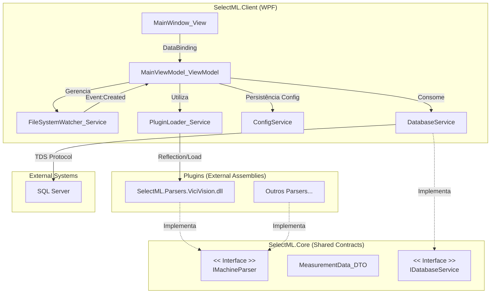

# Documentação de Arquitetura SelectML

Este documento serve como a "Fonte da Verdade" técnica para o projeto SelectML. Destina-se à equipe de engenharia e manutenção, detalhando decisões críticas de arquitetura, concorrência e integração.

## 1. Diagrama de Componentes

A arquitetura segue o padrão MVVM, com separação clara entre a camada de apresentação (Client), o núcleo de domínio (Core) e a persistência de dados.



## 2. Modelo de Concorrência e Threading

O SelectML opera em um ambiente multi-thread para garantir que a Interface do Usuário (UI) permaneça responsiva enquanto processa I/O de arquivos potencialmente bloqueantes.

### 2.1 FileSystemWatcher e Thread Pool
O `FileSystemWatcher` (instanciado em `MainViewModel`) monitora o diretório de entrada.
- **Evento `Created`**: É disparado em uma thread secundária do *Thread Pool*, **não** na UI Thread.
- **Consequência**: Qualquer tentativa de acessar propriedades vinculadas à UI (como `ObservableCollection`) diretamente dentro deste manipulador causará uma `InvalidOperationException`.

### 2.2 Marshalling para UI Thread
Para atualizar a interface com os resultados do processamento, utilizamos o `Dispatcher`:

```csharp
System.Windows.Application.Current.Dispatcher.Invoke(() =>
{
    // Código executado na UI Thread
    PartName = data.PartName;
    MeasuredResults.Add(...);
});
```

Isso garante que as atualizações visuais ocorram de forma segura e síncrona com o loop de renderização do WPF.

### 2.3 Estratégia de "Retry" (File Locking)
Máquinas industriais frequentemente mantêm o arquivo de saída bloqueado (Lock) enquanto escrevem os dados. Tentar ler o arquivo imediatamente após o evento `Created` resulta em exceção de I/O.

Implementamos um padrão de **Spin-Wait** no método `WaitForFileAccess`:
1.  **Tentativas**: Loop de até 10 tentativas (`timeoutSeconds * 2`).
2.  **Delay**: `Task.Delay(500)` (500ms) entre tentativas.
3.  **Verificação**: Tenta abrir o arquivo com `FileMode.Open` e `FileShare.ReadWrite`.
4.  **Validação**: Verifica se `stream.Length > 0` para evitar leituras de arquivos vazios (comuns durante a criação inicial).

## 3. Fluxo de Estados (Human-in-the-Loop)

O sistema abandonou o modelo antigo de "salvamento automático" (Fire-and-Forget) em favor de um fluxo de validação manual, implementando uma Máquina de Estados na `MainViewModel`.

### 3.1 Estados da ViewModel
1.  **Monitorando (Idle)**:
    - O sistema aguarda arquivos no diretório configurado.
    - O `FileSystemWatcher` está ativo.
    - A UI de processamento está limpa ou inativa.

2.  **Pendente de Ação**:
    - Um arquivo foi detectado e parseado com sucesso.
    - Os dados são exibidos na tela para conferência do operador.
    - O monitoramento de novos arquivos é temporariamente ignorado/bloqueado.
    - Botões de ação **Enviar** e **Cancelar** são habilitados.

3.  **Persistindo**:
    - O operador clica em **Enviar**.
    - O sistema consulta o SQL Server para roteamento.
    - O arquivo CSV é gerado no destino correto.
    - A UI é limpa e o sistema retorna ao estado **Monitorando**.

## 4. Estratégia de Codificação (Encoding Strategy)

A correta interpretação de caracteres é crítica neste domínio devido à mistura de hardware legado e requisitos de integração modernos.

### 4.1 Entrada (Parsers de Máquina)
- **Padrão**: `Encoding.Latin1` (ISO-8859-1).
- **Justificativa**: Máquinas de medição legadas e sistemas embarcados frequentemente utilizam tabelas de caracteres ANSI estendidas para representar símbolos de engenharia (ex: Ø para diâmetro, ° para graus, µ para mícrons). O uso de UTF-8 na leitura resultaria em corrupção desses símbolos (mojibake).

### 4.2 Saída (Arquivos CSV Padronizados)
- **Padrão**: `new UTF8Encoding(true)` (UTF-8 com BOM).
- **Justificativa**: O sistema gera arquivos CSV para consumo por terceiros e importação no Excel.
    - O **BOM (Byte Order Mark)** é estritamente necessário para que o Microsoft Excel detecte automaticamente a codificação e exiba corretamente os caracteres especiais sem configuração manual do usuário.

## 5. Mecânica do Sistema de Plugins

A extensibilidade é garantida através de carregamento dinâmico de assemblies, permitindo adicionar suporte a novas máquinas sem recompilar o cliente principal.

### 5.1 Carregamento (PluginLoader)
O serviço `PluginLoader` utiliza Reflection para inspecionar DLLs na pasta `\Plugins`:
1.  **Carregamento**: `Assembly.LoadFrom(dllPath)`.
2.  **Descoberta**: Busca tipos que implementam `SelectML.Core.IMachineParser`, ignorando interfaces e classes abstratas.
3.  **Instanciação**: Utiliza `Activator.CreateInstance(type)` para criar objetos parser.

### 5.2 Isolamento de Falhas
O carregamento de cada DLL é envolvido em um bloco `try-catch`. Se um plugin falhar ao carregar (ex: falta de dependência), ele é logado e ignorado, não impedindo a inicialização da aplicação ou o carregamento de outros plugins válidos.

## 6. Integração de Dados e Roteamento

A camada de persistência foi introduzida para permitir o roteamento dinâmico de arquivos baseado em dados relacionais, substituindo caminhos fixos.

### 6.1 DatabaseService (IDatabaseService)
O `DatabaseService` encapsula toda a lógica de acesso a dados, isolando a dependência do `Microsoft.Data.SqlClient` da camada de apresentação.
- **Responsabilidade**: Executar queries e stored procedures, retornando dados de domínio ou tipos primitivos, nunca expondo objetos `SqlConnection` ou `SqlDataReader`.

### 6.2 Lógica de Roteamento Dinâmico
O diretório de destino do arquivo CSV não é mais estático. Ele é determinado em tempo de execução:
1.  **Extração**: O sistema extrai o `BatchNumber` (Número do Lote) dos dados parseados.
2.  **Consulta SQL**: O `MainViewModel` invoca o `DatabaseService` para buscar o `StationName` associado àquele lote na tabela `dbo.ActiveRun` (juntamente com `dbo.Station`).
3.  **Decisão**:
    - **Sucesso**: Se uma estação é encontrada, o arquivo é salvo em `[CaminhoConfigurado]\[StationName]`.
    - **Fallback**: Se o lote não é encontrado ou ocorre erro na consulta, o arquivo é salvo em `[CaminhoConfigurado]\Unidentified`.

## 7. Estrutura de Dados e Persistência

### 7.1 DTO Universal (MeasurementData)
A classe `MeasurementData` (no projeto Core) atua como o contrato de dados único entre os plugins e a aplicação.
- Ela normaliza os dados brutos da máquina em uma estrutura previsível (`PartName`, `BatchNumber`, `Dictionary<string, double>`).
- Isso desacopla a lógica de exibição e exportação CSV dos formatos proprietários das máquinas.

### 7.2 Configuração (appsettings.json)
O `ConfigService` gerencia a persistência das configurações do usuário em um arquivo `appsettings.json` local.
- **Esquema**:
  ```json
  {
    "WatchDirectory": "C:\\Caminho\\Monitorado",
    "LastPluginName": "Vici Vision M1",
    "DbServer": "localhost\\MLSQLExpress",
    "DbUser": "sa",
    "DbName": "SelectML"
  }
  ```
- O serviço utiliza `System.Text.Json` para serialização/deserialização. O carregamento é resiliente a falhas (retorna configuração padrão se o arquivo não existir ou estiver corrompido).
