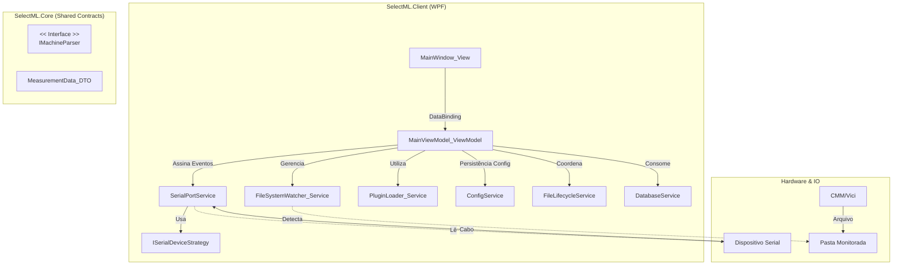

# Documentação de Arquitetura SelectML

Este documento serve como a "Fonte da Verdade" técnica para o projeto SelectML. Destina-se à equipe de engenharia e manutenção, detalhando decisões críticas de arquitetura, fluxo de dados e integrações.

## 1. Diagrama de Componentes (Híbrido)

A arquitetura V1.1.0 suporta entrada dupla: Arquivos (Watcher) e Serial (PortService).

## 2. Fluxo de Dados (Data Flow)

O SelectML V1.1.0 opera em modo **Híbrido**, processando dados de duas fontes distintas com estratégias de buffer diferentes.

### 2.1 Fluxo de Arquivo (Máquinas Automáticas)
1.  **Entrada**: `FileSystemWatcher` detecta arquivo (TXT/CSV).
2.  **Parsing**: Plugin converte para `MeasurementData` (contém Nome da Peça e Lote).
3.  **Validação**: SQL Server valida se a peça existe.
4.  **Buffer**: Dados vão direto para a UI.

### 2.2 Fluxo Serial (Paquímetros/Micrômetros) - "Buffer Reverso"
No fluxo serial, os dados chegam picados (medida a medida) e muitas vezes **antes** do operador definir qual peça está medindo.

1.  **Entrada**: `SerialPortService` recebe bytes -> String.
2.  **Parsing Imediato**: `ISerialDeviceStrategy` converte string bruta em valor numérico.
3.  **Buffer de Espera**:
    - Se o usuário **JÁ** selecionou uma peça na UI: A medida é adicionada à linha atual da tabela.
    - Se **NÃO** há peça selecionada: A medida entra no **"Buffer Reverso"** (uma fila em memória).
4.  **Flush**: Assim que o usuário seleciona/cria uma peça, o Buffer Reverso é descarregado na ordem de chegada, preenchendo as primeiras características.

## 3. Componentes Chave V1.1.0

### SerialService & Strategies
- **SerialPortService**: Singleton. Mantém a porta aberta e o buffer de leitura de bytes.
- **ISerialDeviceStrategy**: Define como interpretar o protocolo.
    - *U-WAVE*: Protocolo Protequality (ex: `01A+123.456CR`).
    - *Custom*: Regex configurável via JSON.

### Design System
A V1.1.0 introduziu um sistema de temas robusto (`Styles/Themes/`), separando paletas de cores (Dark/Light) dos templates de controles.

## 4. Governança de Dados
**(Mantido da V1.0)**
- **Backup First**: Arquivos são copiados para `/Backup` antes do processamento.
- **Safe I/O**: Checksum de tamanho antes de deletar a origem.

## 5. Estratégia de Codificação (Encoding)
- **Arquivo**: `Encoding.Latin1` (Padrão para máquinas legadas).
- **Serial**: ASCII/Latin1.
- **Saída CSV**: `UTF8Encoding(true)` (BOM) para Excel.

## 6. Extensibilidade
- **Plugins de Arquivo**: DLLs externas (`SelectML.Parsers.*.dll`).
- **Drivers Seriais**: Por enquanto, internos (`Strategies/`). Expansão futura para DLLs se necessário.
