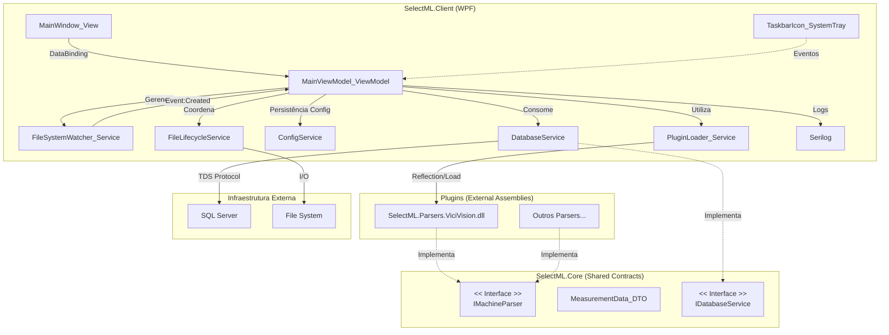

# Documentação de Arquitetura SelectML

Este documento serve como a "Fonte da Verdade" técnica para o projeto SelectML. Destina-se à equipe de engenharia e manutenção, detalhando decisões críticas de arquitetura, fluxo de dados e integrações.

## 1. Diagrama de Componentes

A arquitetura segue o padrão MVVM, com separação clara entre a camada de apresentação (Client), o núcleo de domínio (Core) e a persistência de dados.

## 2. Fluxo de Dados (Data Flow)

O ciclo de vida de um arquivo no SelectML foi desenhado para garantir integridade e rastreabilidade (Data Governance).

### Passo a Passo

1.  **Entrada (Input)**:
    - O `FileSystemWatcher` detecta um novo arquivo na pasta monitorada.
    - Mecanismo de "Debounce/Retry" aguarda a liberação do arquivo (lock) pela máquina.

2.  **Parsing**:
    - O Plugin selecionado lê o arquivo (Encoding Latin1).
    - Converte o texto bruto para o objeto `MeasurementData`.

3.  **Ciclo de Vida (File Lifecycle)**:
    - **Backup Atômico**: O `FileLifecycleService` copia o arquivo original para a pasta `/Backup`.
    - **Verificação**: Confirma se o tamanho do backup bate com a origem.
    - **Delete**: Remove o arquivo da pasta de entrada (limpando a área de drop).
    - *Nota*: Isso ocorre **antes** de qualquer validação de negócio para garantir que nunca perderemos o dado bruto.

4.  **Validação Antecipada (Early Detection)**:
    - O sistema consulta o SQL (`IDatabaseService`) usando o Lote (BatchNumber).
    - Recupera o Nome da Estação e a lista de Features Esperadas.
    - Valida se as medições encontradas conferem com o esperado no banco.

5.  **Decisão (Human-in-the-Loop vs Auto)**:
    - **Manual**: O operador revisa os dados na tela, vê alertas de features não reconhecidas e clica em "Enviar".
    - **Automático**: Se habilitado e sem erros críticos, o sistema pula a revisão e envia direto.

6.  **Geração de Saída**:
    - O arquivo CSV padronizado (UTF-8 BOM) é gerado.
    - Salvo no diretório de destino: `[Root]\[StationName]\`.

## 3. Decisões de Design Chave

### 3.1 Governança de Dados (Backup First)
**Decisão**: Nunca processar o arquivo "in-place".
**Justificativa**: Em ambientes industriais, arquivos podem ser corrompidos ou apagados acidentalmente. A estratégia "Copy-Verify-Delete" garante que sempre tenhamos uma cópia bruta ("Raw Data") no diretório de Backup antes de tentar qualquer lógica de negócio complexa que possa falhar.

### 3.2 Validação Antecipada (Early Detection)
**Decisão**: Validar contra o SQL Server imediatamente após o parse.
**Justificativa**: Em vez de esperar o CSV chegar ao sistema final para descobrir que o lote não existe, o SelectML avisa o operador na hora. Isso reduz o tempo de feedback de horas para segundos.

### 3.3 Modelo de Concorrência
- **Monitoramento**: Thread do `FileSystemWatcher`.
- **UI**: Thread principal (WPF Dispatcher).
- **Background**: Operações pesadas (IO, Banco) são feitas via `Task.Run` ou métodos `Async` para não congelar a interface.
- **System Tray**: A aplicação minimiza para a bandeja, mantendo o monitoramento ativo sem ocupar espaço na barra de tarefas. O ícone pulsa (animação) para indicar atividade.

### 3.4 Logging e Auditoria (Serilog)
- **Console**: Para debug em desenvolvimento.
- **Arquivo**: Logs diários (`logs/log-.txt`) com retenção configurável.
- Registra todas as etapas críticas: detecção de arquivo, sucesso no parse, erros de SQL e limpeza automática.

## 4. Estratégia de Codificação (Encoding)

- **Leitura (Input)**: `Encoding.Latin1` (ISO-8859-1). Essencial para ler símbolos de engenharia (Ø, °) de máquinas legadas.
- **Escrita (Output)**: `UTF8Encoding(true)` (com BOM). Essencial para compatibilidade correta com Excel e sistemas ERP modernos.

## 5. Extensibilidade

Novas máquinas são adicionadas via Plugins (`SelectML.Parsers.*.dll`) depositados na pasta `/Plugins`. O `PluginLoader` descobre e carrega essas DLLs na inicialização, sem necessidade de alterar o executável principal.
